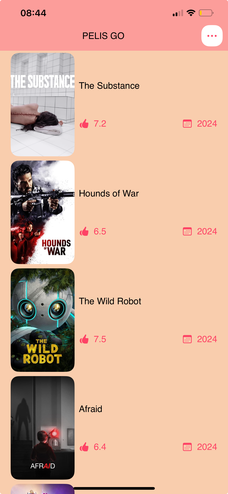
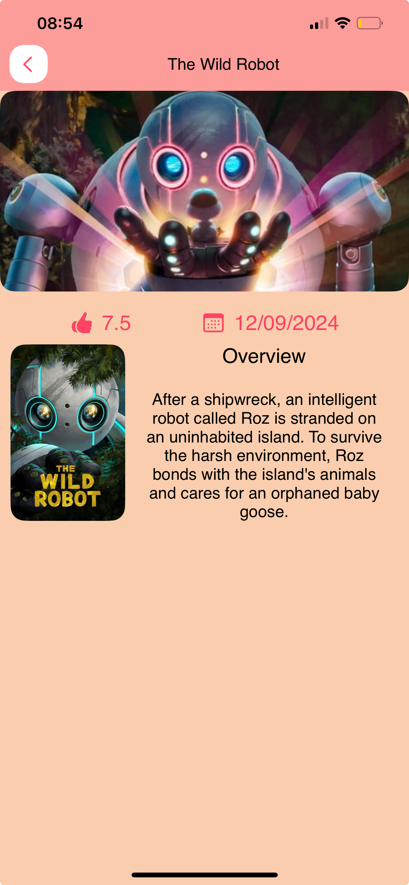

# PelisGo

PelisGo es un pequeño proyecto de prueba para **[iOS]** con el objetivo de mostrar mis habilidades técnicas y forma de desarrollar. La aplicación consiste en mostrar las tendencias en el cine y películas del momento con una puntuación y resumen.

### Requisitos mínimos

* La única configuración a realizar es poner tu ApiKey en la clase "RemoteMovieManager.swift" que obtienes de esta página [themoviedb](https://developer.themoviedb.org/docs).
* Es suficiente con ejecutar el archivo `PelisGo.xcodeproj` en Xcode.

### ¿Que Características tiene la Aplicación?
-Imagen de guía sobre la arquitectura de la aplicación.

* Clean Architecture como enfoque de diseño para la organización e independencia de capas. 
* Diseñado bajo el patrón MVVM.
* Maneja una Base de Datos con Core Data.
* Uso de API.
* Esta escrito íntegramente con Swift y SwiftUI.
* Implementación de pruebas unitarias.
* Adaptación con "Localizable Strings" para 2 idiomas.

## Imagen de Muestra

### Suposiciones

* Se entiende por "Películas Buscadas" a aquellas que el usuario selecciona de la lista para ver más detalles de esta.
* Se entiende por "Películas con Paginación (20 ítems por página)" a que la aplicación gestione internamente las solicitudes poco a poco.

### ¿Cómo puedo contactarte?

## Hola, mi nombre es Angel Curi, soy el creador de PelisGo.

Soy ingeniero de sistemas desde hace más de 3 años. Estoy escuchando ofertas sobre Programacíon iOS, puedes contactarme desde mi perfil de ****.
